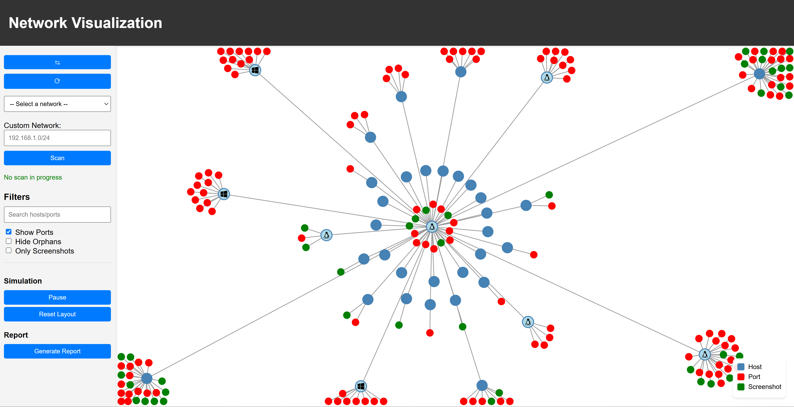

# Netenum

Netenum is a python script to automate the initial information gathering phase and service enumeration phase during an internal penetration test.

## Features

- Discover live hosts on the network using Nmap
- Perform thorough port scan on each host using Nmap
- Curl and screenshot all the webpages hosted to discover hidden webpages

## Preview

This is how a scan looks like:



The script generates a report in the end:


## Installation

Python 3.10 or higher is required to run this script.

```bash
python3 -m venv .venv
source .venv/bin/activate
pip install -r requirements.txt
```

Install Nmap

```bash
sudo apt install nmap
```

Install Chromium

```bash
sudo apt install chromium-browser
```

## Usage

```bash
sudo ./netenum.sh
```

## License

This project is licensed under the MIT License - see the [LICENSE](LICENSE) file for details
