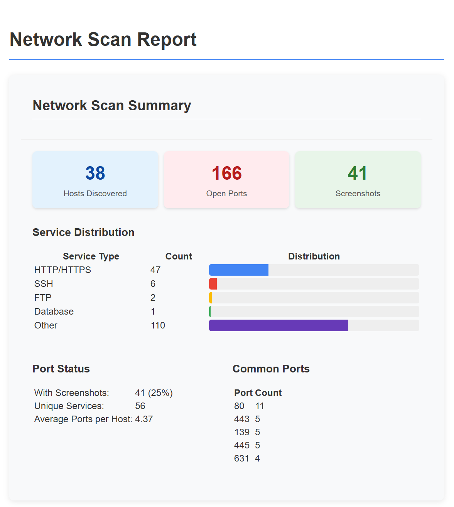

# NetEnum

[](LICENSE)

Netenum is a powerful Python tool designed to automate the initial information gathering and service enumeration phases during internal penetration testing. It streamlines network reconnaissance by discovering live hosts, scanning for open ports, and capturing web content for analysis.

## 🚀 Features

- **Network Discovery**: Efficiently identify live hosts on the network using Nmap
- **Service Enumeration**: Conduct comprehensive port scanning on discovered hosts
- **Web Content Analysis**: Automatically curl and screenshot web pages to discover hidden content
- **Reporting**: Generate detailed reports summarizing findings for easy analysis

## 📊 Preview

This is how a scan looks like in action:


The script generates a detailed report upon completion:



The video below showcases the tool in action, demonstrating its capabilities and ease of use:


https://github.com/user-attachments/assets/a4f76917-8533-4042-a69b-ad459cb5fff8


## 📋 Requirements

- Python 3.10 or higher
- Nmap
- Chromium browser
- Linux-based operating system

## 🔧 Installation

### Quick Installation

```bash
sudo ./netenum.sh
```

### Manual Installation

1. Create and activate a Python virtual environment:

  ```bash
  python3 -m venv .venv
  source .venv/bin/activate
  ```

1. Install Python dependencies:

  ```bash
  pip install -r requirements.txt
  ```

1. Install required system packages:

  ```bash
  sudo apt install nmap chromium-browser
  ```

## 📝 Usage

Run Netenum with administrative privileges:

```bash
sudo ./netenum.sh
```

The tool will:

1. Scan your network for live hosts
2. Enumerate services on discovered hosts
3. Capture screenshots of web services
4. Generate a comprehensive report

## 🤝 Contributing

Contributions are welcome! Feel free to submit a Pull Request.

## 📄 License

This project is licensed under the MIT License - see the [LICENSE](LICENSE) file for details.
